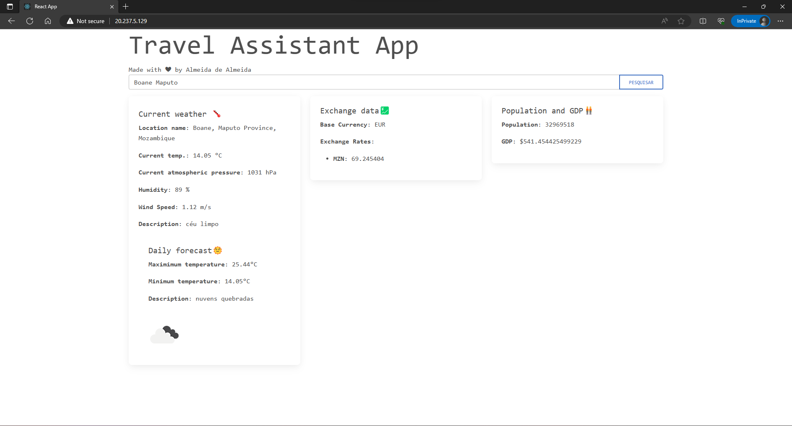

# optimus-travel
A simple travel assistant where users can query a given city and get relevant information about the desired location.

# Preview


## Tech Stack
**Frontend:** the simple UI was built using React

**Backend:** Node, Express

## Run your local version


### Prerequisites
Below are some stuff you need to ensure before running the project:
* Node

### Clone the project

```bash
  git clone https://link-to-project
```

### 1. Backend

#### Environment Variables
To run the backend successfully, you will need to add the following environment variables to your config/.env file
`DB_USER`, `DB_PASSWORD`, `DB_HOST`, `DB_PORT`, `DB_NAME`, `JWT_SECRET`, `RATE_API`, `OPEN_WEATHER_API`, `MAP_BOX_API`

But don't worry if you have those, I've got you covered and included them so that you can test things on the go.
Check the `Dockerfile`, I left them there just for you 🤫.

Go to the project directory

```bash
  cd backend
```

Install dependencies

```bash
  npm install
```

Start the server

```bash
  src/index.js
```

### Frontend

To run the frontend successfully, you will need to add the following environment variables to your .env file
`REACT_APP_APIHOSTPORT`, this will normally be the URL and PORT where your backend is running.

Go to the project directory

```bash
cd frontend
```

Install dependencies

```bash
npm install
```

Start the server

```bash
npm start
```

## Deployment

For demonstratation purposes the App was deployed on Kubernetes, but you can of course deploy it anywhere.
To enable deployment on Kubernetes container images had to be built and pushed to a container registry(DockerHub).

### Frontend
1. Build production ready files - instead of running the frontend as a node app, a better approach is building the static files using the command `npm run build`
2. Dockerfile - contains the instructions to build the container image. `frontend/Dockerfile`

### Backend
For the backend it was straight forward approach, the `backend/Dockerfile` has the instructions to build the image - I've included the the environment variables there for 
demonstration purposes(🤫 this is our secret)

### Kubernetes ⚓
Having the images built and pushed to the container registry of your choice, write your manifest files and just `kubectl` them.
The `deployment` directory contains the manifest files used for this specific project.

## Automation 🔁
For each component of the application I've written continuous integration workflows that simplify, the process of image creation and building.
```mermaid
flowchart TD
A[On code push or manual dispatch] -->|Trigger Workflow| B(Build Docker Image)
B --> |Push Image to DockerHub| C[Docker registry]
 ```

**Manual Dispatch** - given the fact that the API Host must be set in the frontend, I chose to trigger this workflow manually. 

## Demo 🛝
If you are just curious to see a running version of the App, check the following link: [Optimus Travel](http://optimus-travel.almeidadealmeida.com/)

## Documentation 📄
Documentation regarding the API can be found on the link below:
[Documentation](https://documenter.getpostman.com/view/11999124/2s9XxwxaCw)


